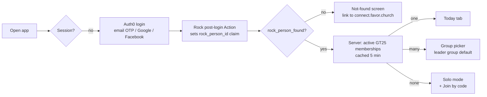
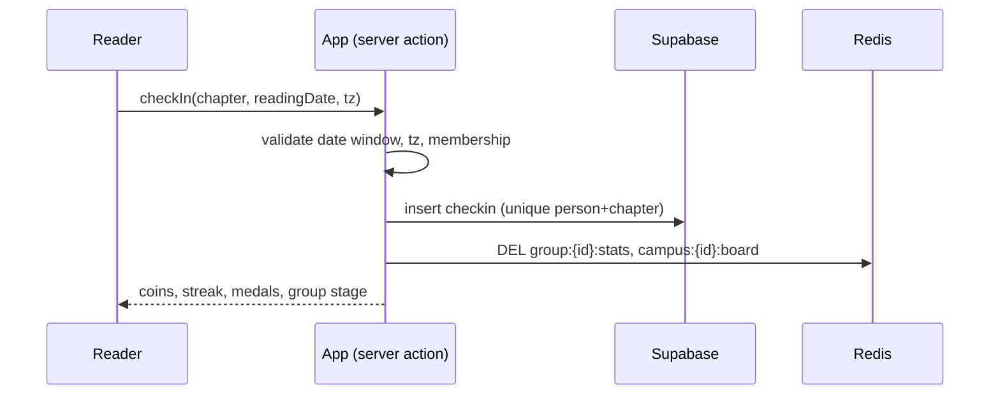
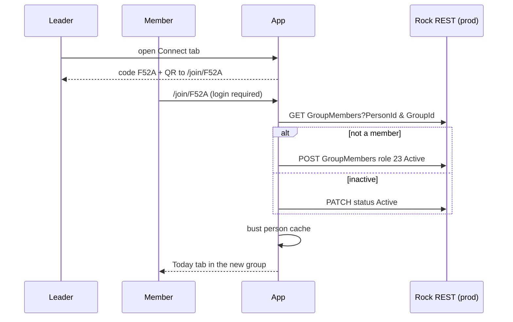

# Read My Bible — User Flows

## Login and landing



## Daily check-in



## Join a group by code



Codes are four characters from `ABCDEFGHJKLMNPQRSTUVWXYZ23456789`, one per group, created the
first time a leader opens the tab. Joining is allowed only while logged in with a Rock person.

## Admin dashboard

```mermaid
flowchart TD
  A[/admin] --> B{Allowlist or active GT24 member?}
  B -- no --> C[403 with link home]
  B -- yes --> D[Resolve scope<br/>allowlist = global root<br/>GT24 = own sections]
  D --> E[Rock: section subtree, GT25 groups, member counts<br/>cached 15 min]
  E --> F[Hierarchy tree<br/>per group: campus, members, readers today, ratio, stage]
  E --> G[Timeline chart<br/>daily ratio Oct 1 → today]
  F --> H[CSV export]
```
